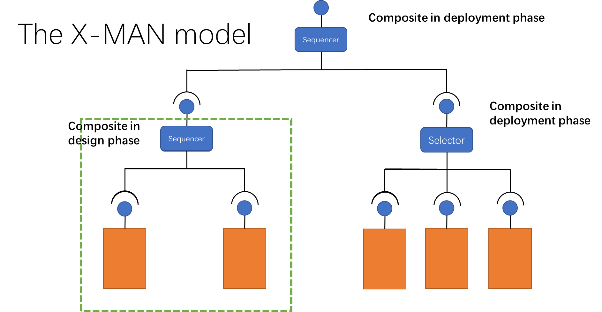
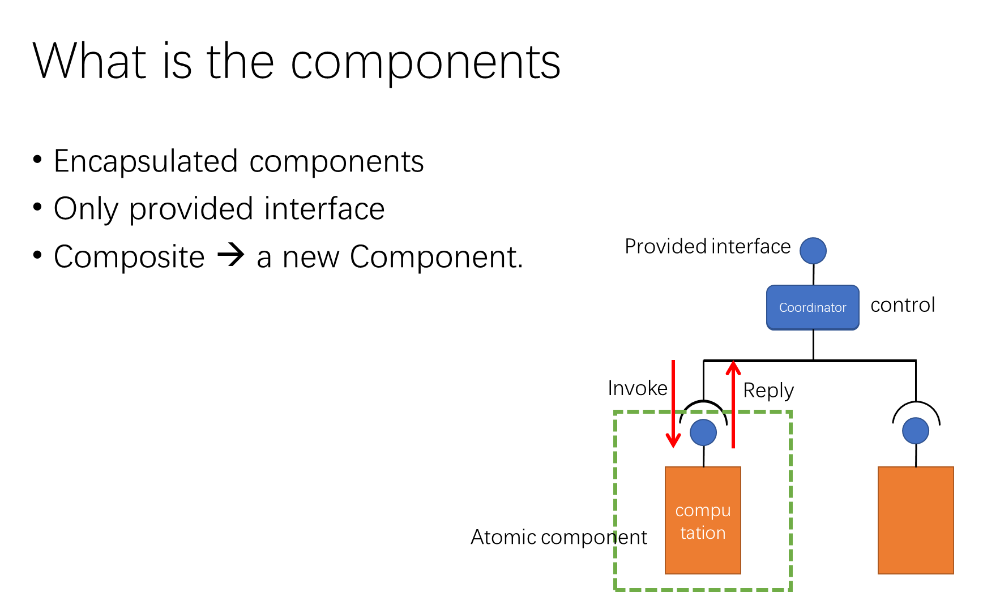
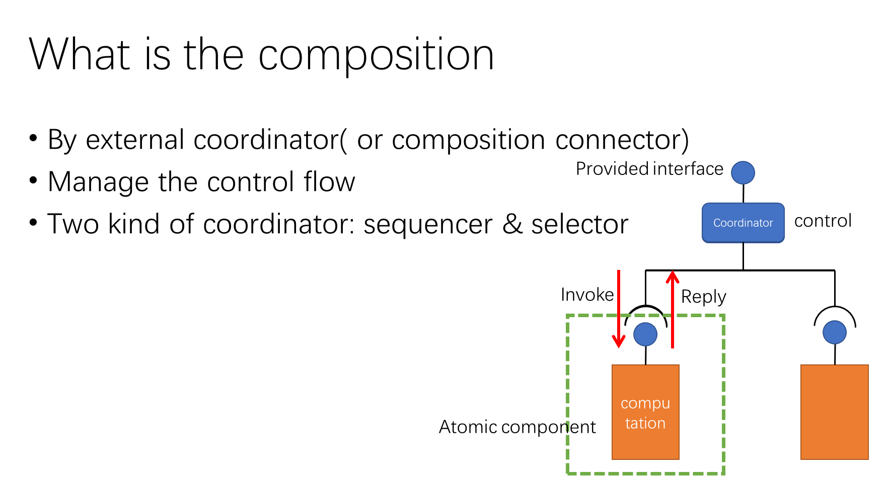
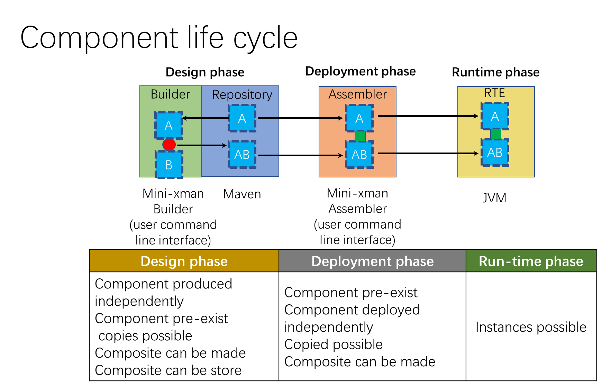
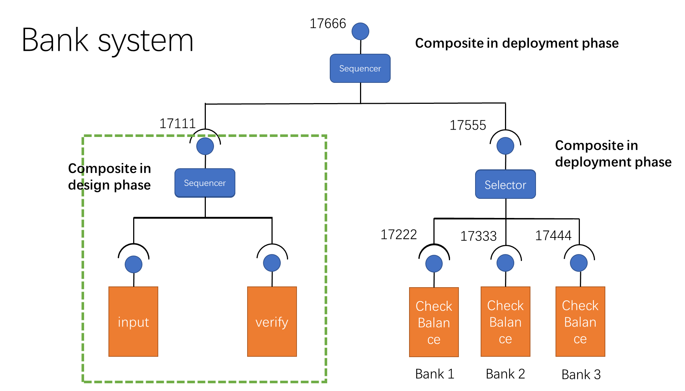

## Project Introduction

This program is the project of COMP62532. The program is highly relevant to the X-Man model concept. Please check the link for more details: [An Introduction to Component-Based Software Development](https://www.worldscientific.com/worldscibooks/10.1142/10486)

This project defines component, connector(including sequencer, selector). It provides sequencer for the design phase. it provides selector and sequencer for the deployment phase. The project also provides a command line user interface for components or composite storage and deployment. As an example, a working banking system was built through this framework.

*The following slides are from my presentation.*

## Model diagram

## Implementation

## Exmaple

